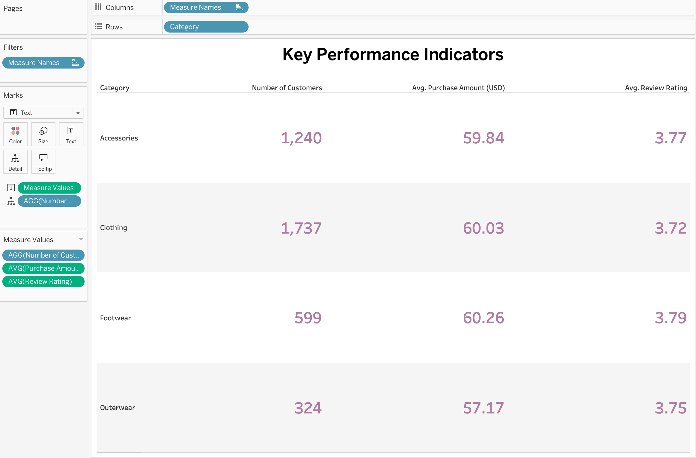

# Customer Shopping Behavior Analysis

## Overview

This project analyzes customer shopping behavior data to gain insights into purchasing patterns, demographics, and business metrics.

## Dashboard Screenshots

### 1. Customer Behavior Dashboard

### 2. Customer by Subscription Status

### 3. Key Performance Indicators (KPI)

### 4. Revenue by Category

### 5. Revenue by Age Group

## Files in this Repository

- `customer_shopping_behavior.csv` - Raw customer data
- `Customer_Shopping_Behaviour_Analysis.py` - Python analysis script
- `customer.sql` - SQL queries for analysis
- `Customer_Behavior_analysis .twb` - Tableau workbook

## Technologies Used

- Python (pandas)
- PostgreSQL
- Tableau
- SQL
